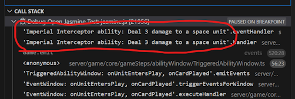

# Debugging Cards and Game Logic

Finding the root cause of bugs in card behaviors or game logic can be daunting. However, there are some very effective tools and techniques available to help with debugging that can make it straightforward and efficient. This document presents some basic starting guides on how to leverage the tools present in Visual Studio Code (VSCode) and in this repo for effectively debugging issues.

The first section gives a high-level overview of how to debug in specific types of situations, such as problems with action abilities or with triggered abilities, and useful places in the code to start debugging for them. The second section lists some generally useful tools and techniques.

If you're unfamiliar with debugging in VSCode, start by reading how to trigger breakpoints after other breakpoints **TODO THIS PR: insert link** as this technique should be used in every debugging situation below. Failing to do so will dramatically slow down your debugging.

## Situational debugging guides

### Action or action ability not triggering / resolving on click
If a game action (play a card, attack, smuggle) or an action ability (action printed on a card) is not available when the card is clicked, start with the following steps:

1. Set a up a breakpoint in your test and a **TODO THIS PR: insert link** conditioned breakpoint at this code line in ActionWindow.js (note: the number may have changed): [`if (legalActions.length === 0) {`](https://github.com/AMMayberry1/forceteki/blob/418d09a36bf24e3905e3d3e6d1cd00793ef17d1b/server/game/core/gameSteps/ActionWindow.js#L38)

2. Inspect the value of the variable `actions`. It should list all available actions for the card (even if they are not legal). If your action doesn't appear in the list, then start debugging the code in ActionWindow.js that populates that variable.

3. If your action does appear in `actions`, then inspect the value of `legalActions`. This is the list of actions filtered down to just those whose requirements have been met. If your action doesn't appear in the list, then start debugging the code in ActionWindow.js that populates that variable.

4. If your action appears in both `actions` and `legalActions`, then it is being triggered correctly. If `legalActions` has only one item then it will be automatically resolved without prompting the user. If you are sure that the ability is not correctly resolving, then you need to move on to debugging the individual GameSystems involved (see **TODO THIS PR: insert link**).

### Triggered ability not triggering / resolving on event
If a triggered ability is not activating in response to the expected trigger, start with the following steps:

1. Set a up a breakpoint in your test and a **TODO THIS PR: insert link** conditioned breakpoint at this code line in TriggeredAbility.ts (note: the number may have changed): [`for (const player of this.game.getPlayers()) {`](https://github.com/AMMayberry1/forceteki/blob/418d09a36bf24e3905e3d3e6d1cd00793ef17d1b/server/game/core/ability/TriggeredAbility.ts#L78)

2. When the breakpoint is hit, look at the call stack to confirm that the ability being triggered is the ability you are attempting to debug (see image below). If not, use the continue button to keep hitting the breakpoint until the ability you want is triggered. If the ability is never triggered, then something is wrong with the trigger itself - double-check that you are using the right event name for the trigger and use the **TODO THIS PR: link** pipeline debugging steps to investigate whether the trigger event is happening as intended.

3. If you see that the relevant card ability is triggered, you can inspect the `event` parameter's properties to confirm that the emitted event matches what is expected.

4. Code execution must reach the line [`window.addToWindow(context);`](https://github.com/AMMayberry1/forceteki/blob/418d09a36bf24e3905e3d3e6d1cd00793ef17d1b/server/game/core/ability/TriggeredAbility.ts#L88) for the ability to be resolved. Step through the code and determine whether any of the checks that happen before that line are failing.

5. If [`window.addToWindow(context);`](https://github.com/AMMayberry1/forceteki/blob/418d09a36bf24e3905e3d3e6d1cd00793ef17d1b/server/game/core/ability/TriggeredAbility.ts#L88) is reached, then the trigger is working properly and the triggered ability is being queued for resolution. Move on **TODO THIS PR: links** debugging the game system(s) and the pipeline to determine what is causing resolution of the ability to fail.

